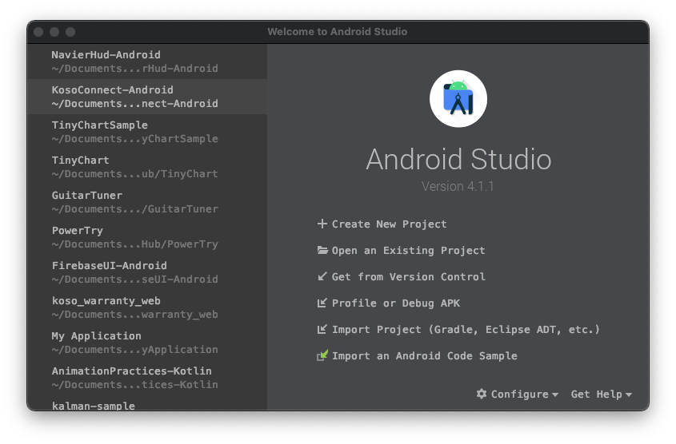
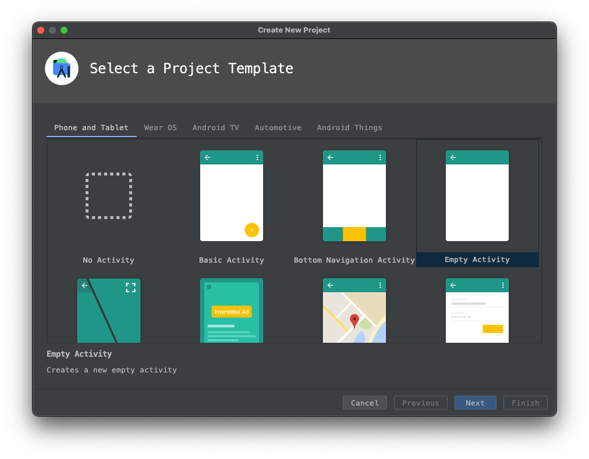
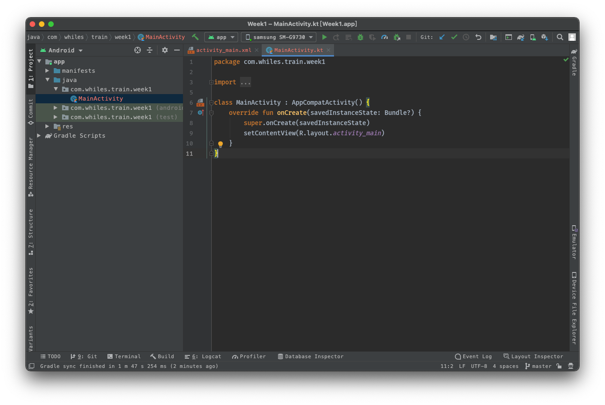
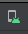

# Android與Kotlin語言簡介
## 安裝 Android Studio
1. 在 [https://developer.android.com/studio](https://developer.android.com/studio)下載 Android Studio 
1. 在PC/MAC上執行安裝程序
1. 由 Configure / Preferences 進入設定頁面
    - Appearance & Behavior / Appearance 設定介面風格
    - Editor / Font 設定字型
---
## 建立第一個專案

1. 點擊按鈕 Create New Project 來新增一個專案



2. 選擇 Empty Activity範本



3. 仔細端詳 Android Studio 開發環境



---
## 安裝虛擬機器

1. 上方工具列按下AVD Manager按鈕 ，建立虛擬裝置

2. 按下 Create Viretual Device 選擇虛擬裝置大小和版本 (需要時間下載Android版本)

3. 啟動虛擬機器

4. 在Android Studio 執行剛剛所建立的專案

---

## 簡述Android專案結構

### The Manifest file 及其用途

位置在:
 [專案]/app/src/main/AndroidManifest.xml

1. 宣告用到的使用者權限
2. ~~宣告 minimum API Level~~
3. 宣告硬體規格需求(前後相機鏡頭、藍芽、多點觸控)
4. 宣告用到的外部程式庫參數
5. 宣告App使用到的元件，包含Android的四大元件

```xml
<manifest ... >
    <uses-feature android:name="android.hardware.camera.any"
                  android:required="true" />
    <uses-sdk android:minSdkVersion="7" android:targetSdkVersion="19" />
    ...
</manifest>
```

Android 四大元件包含Activity, Service, Broadcast Receiver 和 Content Provider

```xml
<?xml version="1.0" encoding="utf-8"?>
<manifest ... >
    ...
    <application ... >
        <activity android:name="com.example.project.ComposeEmailActivity">
            <intent-filter>
                <action android:name="android.intent.action.SEND" />
                <data android:type="*/*" />
                <category android:name="android.intent.category.DEFAULT" />
            </intent-filter>
        </activity>
    </application>
</manifest>
```

- \<activity\> elements for activities.
- \<service\> elements for services.
- \<receiver\> elements for broadcast receivers.
- \<provider\> elements for content providers.

#### Intent 和 Intent filter

Android App 允許系統中其他App可以呼叫其他App，支援相關動作的元件。例如，我需要寄電子郵件時，可以呼叫其他支援電子郵件的App來幫忙處理寄件。

在實務上就是丟出一個Intent，尋求可以支援寄送的Activity來幫忙。

Android App中的Activity

Web reference: [https://developer.android.com/guide/components/fundamentals](https://developer.android.com/guide/components/fundamentals)

### App resources


### build.gradle file
