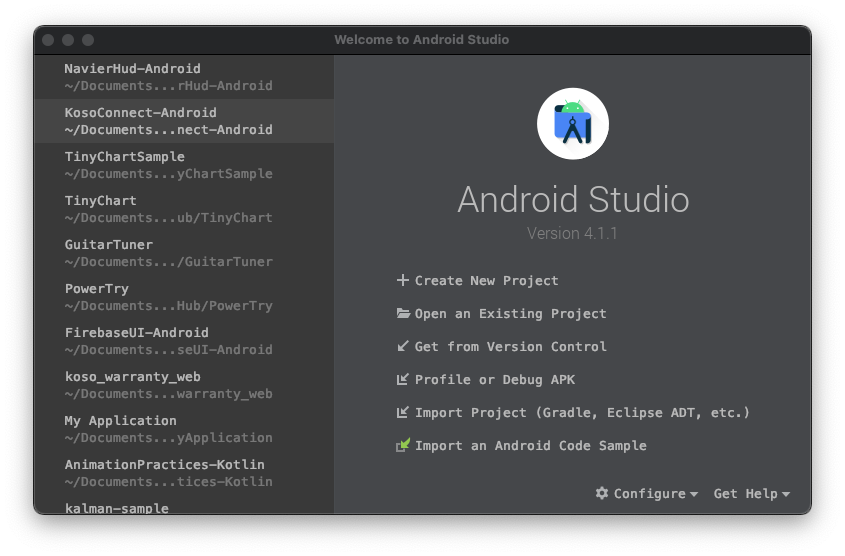

# Android與Kotlin語言簡介

## 安裝 Android Studio

1. 在 [https://developer.android.com/studio](https://developer.android.com/studio)下載 Android Studio 
2. 在PC/MAC上執行安裝程序
3. 由 Configure / Preferences 進入設定頁面
   * Appearance & Behavior / Appearance 設定介面風格
   * Editor / Font 設定字型

## 建立第一個專案

1. 點擊按鈕 Create New Project 來新增一個專案



1. 選擇 Empty Activity範本


1. 仔細端詳 Android Studio 開發環境


## 安裝虛擬機器

1. 上方工具列按下AVD Manager按鈕 ，建立虛擬裝置
2. 按下 Create Viretual Device 選擇虛擬裝置大小和版本 \(需要時間下載Android版本\)
3. 啟動虛擬機器
4. 在Android Studio 執行剛剛所建立的專案

## 簡述Android專案結構

### The Manifest file 及其用途

> 位置在: \[專案\]/app/src/main/AndroidManifest.xml

1. 宣告用到的使用者權限
2. ~~宣告 minimum API Level~~
3. 宣告硬體規格需求\(前後相機鏡頭、藍芽、多點觸控\)
4. 宣告用到的外部程式庫參數
5. 宣告App使用到的元件，包含Android的四大元件

```markup
<manifest ... >
    <uses-feature android:name="android.hardware.camera.any"
                  android:required="true" />
    <uses-sdk android:minSdkVersion="7" android:targetSdkVersion="19" />
    ...
</manifest>
```

Android 四大元件包含Activity, Service, Broadcast Receiver 和 Content Provider

```markup
<?xml version="1.0" encoding="utf-8"?>
<manifest ... >
    ...
    <application ... >
        <activity android:name="com.example.project.ComposeEmailActivity">
            <intent-filter>
                <action android:name="android.intent.action.SEND" />
                <data android:type="*/*" />
                <category android:name="android.intent.category.DEFAULT" />
            </intent-filter>
        </activity>
    </application>
</manifest>
```

* &lt;activity&gt; elements for activities.
* &lt;service&gt; elements for services.
* &lt;receiver&gt; elements for broadcast receivers.
* &lt;provider&gt; elements for content providers.

#### Intent 和 Intent filter

Android App 允許系統中其他App可以呼叫其他App，支援相關動作的元件。例如，我需要寄電子郵件時，可以呼叫其他支援電子郵件的App來幫忙處理寄件。

在實務上就是丟出一個Intent，尋求可以支援寄送的Activity來幫忙。

Web reference: [https://developer.android.com/guide/components/fundamentals](https://developer.android.com/guide/topics/manifest/manifest-intro)

### App resources

> 位置在：\[專案\]/app/src/main/res/

App 資源包含了圖片、聲音、多國語言字串、動畫設定、排版設定、顏色設定、風格、外部字型等。將資源檔分開將有助於管理提供不同類型的資源或修改不同的風格，而不需要動到程式碼。


不能直接將檔案存在/res/底下，會造成編譯錯誤

\*\*\*\*

<table>
  <thead>
    <tr>
      <th style="text-align:left">Directory</th>
      <th style="text-align:left">Resource Type</th>
    </tr>
  </thead>
  <tbody>
    <tr>
      <td style="text-align:left"><code>animator/</code>
      </td>
      <td style="text-align:left">XML files that define <a href="https://developer.android.com/guide/topics/graphics/prop-animation">property animations</a>.</td>
    </tr>
    <tr>
      <td style="text-align:left"><code>anim/</code>
      </td>
      <td style="text-align:left">XML files that define <a href="https://developer.android.com/guide/topics/graphics/view-animation#tween-animation">tween animations</a>.
        (Property animations can also be saved in this directory, but the <code>animator/</code> directory
        is preferred for property animations to distinguish between the two types.)</td>
    </tr>
    <tr>
      <td style="text-align:left"><code>color/</code>
      </td>
      <td style="text-align:left">XML files that define a state list of colors. See <a href="https://developer.android.com/guide/topics/resources/color-list-resource">Color State List Resource</a>
      </td>
    </tr>
    <tr>
      <td style="text-align:left"><code>drawable/</code>
      </td>
      <td style="text-align:left">
        <p>Bitmap files (<code>.png</code>, <code>.9.png</code>, <code>.jpg</code>, <code>.gif</code>)
          or XML files that are compiled into the following drawable resource subtypes:</p>
        <ul>
          <li>Bitmap files</li>
          <li>Nine-Patches (re-sizable bitmaps)</li>
          <li>State lists</li>
          <li>Shapes</li>
          <li>Animation drawables</li>
          <li>Other drawables</li>
        </ul>
        <p>See <a href="https://developer.android.com/guide/topics/resources/drawable-resource">Drawable Resources</a>.</p>
      </td>
    </tr>
    <tr>
      <td style="text-align:left"><code>mipmap/</code>
      </td>
      <td style="text-align:left">Drawable files for different launcher icon densities. For more information
        on managing launcher icons with <code>mipmap/</code> folders, see <a href="https://developer.android.com/tools/projects#mipmap">Managing Projects Overview</a>.</td>
    </tr>
    <tr>
      <td style="text-align:left"><code>layout/</code>
      </td>
      <td style="text-align:left">XML files that define a user interface layout. See <a href="https://developer.android.com/guide/topics/resources/layout-resource">Layout Resource</a>.</td>
    </tr>
    <tr>
      <td style="text-align:left"><code>menu/</code>
      </td>
      <td style="text-align:left">XML files that define app menus, such as an Options Menu, Context Menu,
        or Sub Menu. See <a href="https://developer.android.com/guide/topics/resources/menu-resource">Menu Resource</a>.</td>
    </tr>
    <tr>
      <td style="text-align:left"><code>raw/</code>
      </td>
      <td style="text-align:left">
        <p>Arbitrary files to save in their raw form. To open these resources with
          a raw <a href="https://developer.android.com/reference/java/io/InputStream"><code>InputStream</code></a>,
          call <a href="https://developer.android.com/reference/android/content/res/Resources#openRawResource(int)"><code>Resources.openRawResource()</code></a> with
          the resource ID, which is <code>R.raw.</code><em><code>filename</code></em>.</p>
        <p>However, if you need access to original file names and file hierarchy,
          you might consider saving some resources in the <code>assets/</code> directory
          (instead of <code>res/raw/</code>). Files in <code>assets/</code> aren&apos;t
          given a resource ID, so you can read them only using <a href="https://developer.android.com/reference/android/content/res/AssetManager"><code>AssetManager</code></a>.</p>
      </td>
    </tr>
    <tr>
      <td style="text-align:left"><code>values/</code>
      </td>
      <td style="text-align:left">
        <p>XML files that contain simple values, such as strings, integers, and colors.</p>
        <p>Whereas XML resource files in other <code>res/</code> subdirectories define
          a single resource based on the XML filename, files in the <code>values/</code> directory
          describe multiple resources. For a file in this directory, each child of
          the <code>&lt;resources&gt;</code> element defines a single resource. For
          example, a <code>&lt;string&gt;</code> element creates an <code>R.string</code> resource
          and a <code>&lt;color&gt;</code> element creates an <code>R.color</code> resource.</p>
        <p>Because each resource is defined with its own XML element, you can name
          the file whatever you want and place different resource types in one file.
          However, for clarity, you might want to place unique resource types in
          different files. For example, here are some filename conventions for resources
          you can create in this directory:</p>
        <ul>
          <li>arrays.xml for resource arrays (<a href="https://developer.android.com/guide/topics/resources/more-resources#TypedArray">typed arrays</a>).</li>
          <li>colors.xml for <a href="https://developer.android.com/guide/topics/resources/more-resources#Color">color values</a>
          </li>
          <li>dimens.xml for <a href="https://developer.android.com/guide/topics/resources/more-resources#Dimension">dimension values</a>.</li>
          <li>strings.xml for <a href="https://developer.android.com/guide/topics/resources/string-resource">string values</a>.</li>
          <li>styles.xml for <a href="https://developer.android.com/guide/topics/resources/style-resource">styles</a>.</li>
        </ul>
        <p>See <a href="https://developer.android.com/guide/topics/resources/string-resource">String Resources</a>,
          <a
          href="https://developer.android.com/guide/topics/resources/style-resource">Style Resource</a>, and <a href="https://developer.android.com/guide/topics/resources/more-resources">More Resource Types</a>.</p>
      </td>
    </tr>
    <tr>
      <td style="text-align:left"><code>xml/</code>
      </td>
      <td style="text-align:left">Arbitrary XML files that can be read at runtime by calling <a href="https://developer.android.com/reference/android/content/res/Resources#getXml(int)"><code>Resources.getXML()</code></a>.
        Various XML configuration files must be saved here, such as a <a href="https://developer.android.com/guide/topics/search/searchable-config">searchable configuration</a>.</td>
    </tr>
    <tr>
      <td style="text-align:left"><code>font/</code>
      </td>
      <td style="text-align:left">Font files with extensions such as <code>.ttf</code>, <code>.otf</code>,
        or <code>.ttc</code>, or XML files that include a <code>&lt;font-family&gt;</code> element.
        For more information about fonts as resources, go to <a href="https://developer.android.com/guide/topics/ui/look-and-feel/fonts-in-xml">Fonts in XML</a>.</td>
    </tr>
  </tbody>
</table>

Web reference: [https://developer.android.com/guide/topics/resources/providing-resources](https://developer.android.com/guide/topics/resources/providing-resources)


## Build Process

當按下執行後，發生了什麼事？


