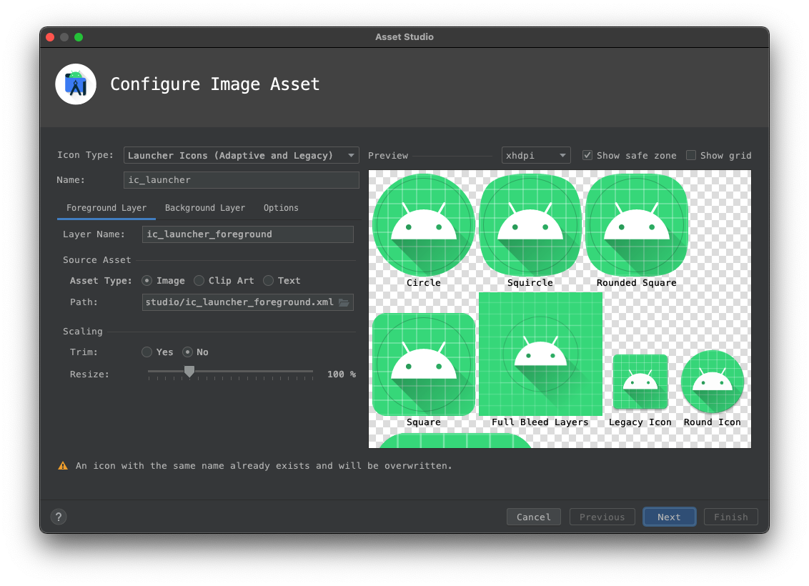
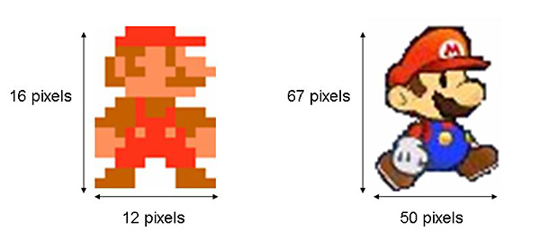

# \#2 認識Android開發環境

## 修改圖示與App名稱

Android App的圖示設定在 _\[專案\]/app/src/main/AndroidManifest.xml_  當中，圖示通常放置在_\[專案\]/app/src/main/mipmap/_ 底下

```markup
<application
        ...
        android:icon="@mipmap/ic_launcher"
        >
                ...
</application>
```





### 圖示文件，/res/drawable，/res/mipmap

#### Android 單位/解析度概念

#### 建立圖示工具，向量與點陣圖示

### 字串文件，/res/value/strings.xml

#### 處理多國語言

## 排版編輯工具

### Widget: TextView、Button、ImageView

