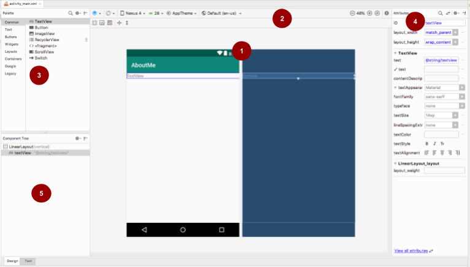

# \#2 認識Android開發環境

## 修改圖示與App名稱

Android App的圖示設定在 *\[專案\]/app/src/main/AndroidManifest.xml*  當中，圖示通常放置在 */res/mipmap/* 底下

```markup
<application
        ...
        android:icon="@mipmap/ic_launcher"
        android:label="@string/app_name"
        >
                ...
</application>
```


### 圖示文件，/res/drawable，/res/mipmap

這兩個資料夾都是用來放置圖示的，mipmap 資料夾通常用來放App的圖示，而drawable 資料夾則放app應用程式當中所使用到的其他圖檔或xml資源

> 為了加快彩現速度和減少圖像鋸齒，貼圖被處理成由一系列被預先計算和最佳化過的圖片組成的檔案,這樣的貼圖被稱為 MIP map 或者 mipmap

使用Image Asset Studio來產生圖示，開啟Asset Studio的方式為，點選模組資料夾([專案]/app)點滑鼠右鍵，選擇 New/ImageAsset


#### Android 單位/解析度概念

觀察drawable和mipmap資料夾，會發現後面除了mipmap還有解析度定義， 例如: res/mipmap-hdpi

為了在不同解析度的裝置中，能夠使用不同的圖來展示，以避免出現鋸齒的情況，我們在提供圖示的時候，會提供幾個基本的size


|:--|:--|:--|
| mdpi: | 48px x 48px | (1x)| 
| hdpi: | 72px x 72px | (1.5x)|
| xhdpi:| 96px x 96px | (2x) |
| xxhdpi:|   144px x 144px | (3x)|
| xxxhdpi:|  192px x 192px | (4x) |

#### 建立資源資料夾工具

drawable或mipmap資料夾，可以在資料夾名稱中加上綴字，已宣告合適適用的國家、語言、解析度、旋轉方向

Android Studio提供了建立資源資料夾工具，來協助開發者建立不同需求的資料夾。開啟建立資源資料夾工具時，可以由選擇[專案]/app/資料夾後，單擊右鍵選擇New/Android resource directory 來開啟資料夾工具。

 

> 沒有綴詞的資料夾，為預設資料夾，當系統在有綴字的資料夾都找不到合適的資源時，就會使用預設資料夾當中的資源


#### 自適應圖示

Android 8.0 (API 26) 引入了自適應啟動圖標功能，他可以在不同設備上，顯示不同形狀，以適應不同OEM廠商的不同圖示遮罩


在更早的版本中，Launcher圖示的大小為48dp x 48dp，現在則必須提供兩個圖層的圖示：
1. 兩個圖層大小為108dp x 108dp
2. 已屏蔽的視口顯示為72dp x 72dp
3. 系統為4個面中每一面的外層保留18dp以創建有趣的視覺效果


參考文件[https://developer.android.com/guide/practices/ui_guidelines/icon_design_adaptive](https://developer.android.com/guide/practices/ui_guidelines/icon_design_adaptive)

創建資源在*res/mipmap-anydpi-v26/ic_launcher.xml* 中，以便用於Android 8.0(API26)以上

```xml
 <?xml version="1.0" encoding="utf-8"?>
    <adaptive-icon xmlns:android="http://schemas.android.com/apk/res/android">
        <background android:drawable="@drawable/ic_launcher_background" />
        <foreground android:drawable="@drawable/ic_launcher_foreground" />
    </adaptive-icon>
```

### 字串文件，/res/value/strings.xml

Android App的名稱設定在 *\[專案\]/app/src/main/AndroidManifest.xml*  當中，指定字串通常放置在 *\/res/values/strings.xml* 底下

```markup
<application
        ...
        android:icon="@mipmap/ic_launcher"
        android:label="@string/app_name"
        >
                ...
</application>
```

在strings.xml當中修改所對應App名稱的字串，就能修改其名稱。(需要重新安裝App)

```xml
<resources>
    <string name="app_name">Week1</string>
</resources>
```

#### 處理多國語言

/res/values/ 和drawable或mipmap資料夾一樣，可以在資料夾使用資源資料夾工具，來幫資料夾名稱中加上適合的綴字，已提供合適不同的國家、語言、解析度、旋轉方向等相對應的資源。

試著建立一個用於台灣的繁體中文資源資料夾，建立完成後/res/資料夾當中會出現一個/values-zh-rTW的資料夾，我們可以在裡面新增一個strings.xml來放置中文的字串資源。讓中文使用者裝置中，看到的是中文的App名稱，以及中文內容。


## 排版編輯工具

### 排版文件，/res/layout/activity_main.xml

開啟排版文件同時，會開啟排版編輯器。



```xml
<?xml version="1.0" encoding="utf-8"?>
<androidx.constraintlayout.widget.ConstraintLayout xmlns:android="http://schemas.android.com/apk/res/android"
    xmlns:app="http://schemas.android.com/apk/res-auto"
    xmlns:tools="http://schemas.android.com/tools"
    android:layout_width="match_parent"
    android:layout_height="match_parent"
    tools:context=".MainActivity">

    <TextView
        android:layout_width="wrap_content"
        android:layout_height="wrap_content"
        android:text="Hello World!"
        app:layout_constraintBottom_toBottomOf="parent"
        app:layout_constraintLeft_toLeftOf="parent"
        app:layout_constraintRight_toRightOf="parent"
        app:layout_constraintTop_toTopOf="parent" />

</androidx.constraintlayout.widget.ConstraintLayout>
```

🚩 **ConstraintLayout**


### 布局

在排版檔案當中，會使用到兩種類型的元素，View和ViewGroup。View是基本元件，如Button、TextView等。ViewGroup則提供不同的佈局結構來容納多個View或是ViewGroup，如LinearLayout、ConstraintLayout等(ViewGroup皆取名為xxxLayout)


### Widget: TextView、Button、ImageView

