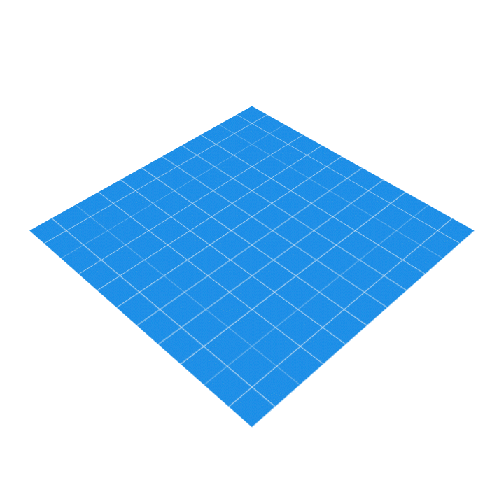

# \#2 認識Android開發環境

## 修改圖示與App名稱

Android App的圖示設定在 *\[專案\]/app/src/main/AndroidManifest.xml*  當中，圖示通常放置在 *\[專案\]/app/src/main/res/mipmap/* 底下

```markup
<application
        ...
        android:icon="@mipmap/ic_launcher"
        >
                ...
</application>
```


### 圖示文件，/res/drawable，/res/mipmap

這兩個資料夾都是用來放置圖示的，mipmap 資料夾通常用來放App的圖示，而drawable 資料夾則放app應用程式當中所使用到的其他圖檔或xml資源

> 為了加快彩現速度和減少圖像鋸齒，貼圖被處理成由一系列被預先計算和最佳化過的圖片組成的檔案,這樣的貼圖被稱為 MIP map 或者 mipmap

使用Image Asset Studio來產生圖示，開啟Asset Studio的方式為，點選模組資料夾([專案]/app)點滑鼠右鍵，選擇 New/ImageAsset


#### Android 單位/解析度概念

觀察drawable和mipmap資料夾，會發現後面除了mipmap還有解析度定義， 例如: res/mipmap-hdpi

為了在不同解析度的裝置中，能夠使用不同的圖來展示，以避免出現鋸齒的情況，我們在提供圖示的時候，會提供幾個基本的size


|:--|:--|:--|
| mdpi: | 48px x 48px | (1x)| 
| hdpi: | 72px x 72px | (1.5x)|
| xhdpi:| 96px x 96px | (2x) |
| xxhdpi:|   144px x 144px | (3x)|
| xxxhdpi:|  192px x 192px | (4x) |

#### 自適應圖示

Android 8.0 (API 26) 引入了自適應啟動圖標功能，他可以在不同設備上，顯示不同形狀，以適應不同OEM廠商的不同圖示遮罩



在更早的版本中，Launcher圖示的大小為48dp x 48dp，現在則必須提供兩個圖層的圖示：
1. 兩個圖層大小為108dp x 108dp
2. 已屏蔽的視口顯示為72dp x 72dp
3. 系統為4個面中每一面的外層保留18dp以創建有趣的視覺效果


參考文件[https://developer.android.com/guide/practices/ui_guidelines/icon_design_adaptive](https://developer.android.com/guide/practices/ui_guidelines/icon_design_adaptive)

創建資源在*res/mipmap-anydpi-v26/ic_launcher.xml* 中，以便用於Android 8.0(API26)以上

```xml
 <?xml version="1.0" encoding="utf-8"?>
    <adaptive-icon xmlns:android="http://schemas.android.com/apk/res/android">
        <background android:drawable="@drawable/ic_launcher_background" />
        <foreground android:drawable="@drawable/ic_launcher_foreground" />
    </adaptive-icon>
```

### 字串文件，/res/value/strings.xml

#### 處理多國語言

## 排版編輯工具

### Widget: TextView、Button、ImageView

