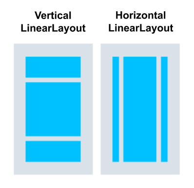
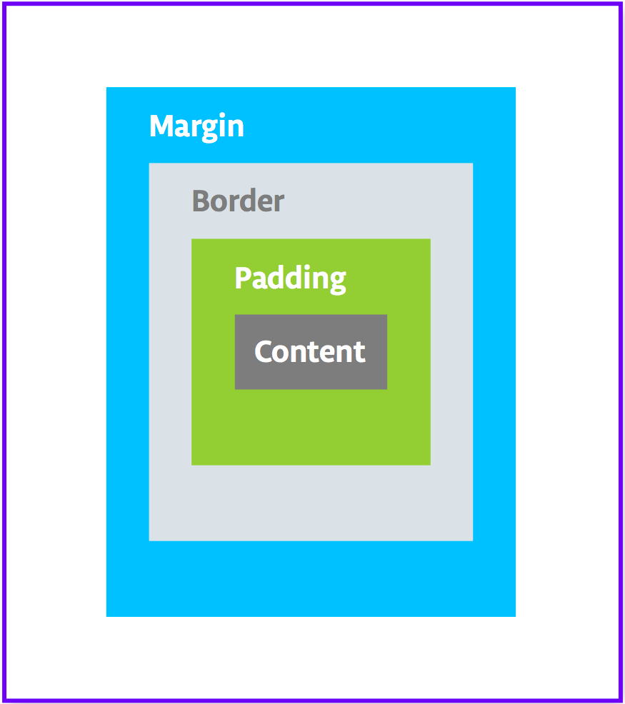

# \#3 介面排版與變數運算

## 排版編輯工具

### 排版文件，/res/layout/activity_main.xml

開啟排版文件同時，會開啟排版編輯器。


1. 設計編輯區
2. 工具欄
3. View/ViewGroup 選單
4. 屬性設定
5. 元件結構

```xml
<?xml version="1.0" encoding="utf-8"?>
<androidx.constraintlayout.widget.ConstraintLayout xmlns:android="http://schemas.android.com/apk/res/android"
    xmlns:app="http://schemas.android.com/apk/res-auto"
    xmlns:tools="http://schemas.android.com/tools"
    android:layout_width="match_parent"
    android:layout_height="match_parent"
    tools:context=".MainActivity">

    <TextView
        android:layout_width="wrap_content"
        android:layout_height="wrap_content"
        android:text="Hello World!"
        app:layout_constraintBottom_toBottomOf="parent"
        app:layout_constraintLeft_toLeftOf="parent"
        app:layout_constraintRight_toRightOf="parent"
        app:layout_constraintTop_toTopOf="parent" />

</androidx.constraintlayout.widget.ConstraintLayout>
```

這個排版文件當中使用了一個ConstraintLayout的布局結構(ViewGroup)，ConstraintLayout當中擺放了一個TextView的View元件。


### 布局(ViewGroup)

在排版檔案當中，會使用到兩種類型的元素，View和ViewGroup。View是基本元件，如Button、TextView等。ViewGroup是一種特殊的View，用來提供不同的佈局結構來容納多個View或是ViewGroup，如LinearLayout、ConstraintLayout等(ViewGroup皆取名為xxxLayout)


#### LinearLayout

LinearLayout用來將其中的View以垂直或水平的方向來排列，試著將res/layout/activity_main.xml檔案中的ConstraintLayout刪除改成LinearLayout。



```xml
<?xml version="1.0" encoding="utf-8"?>
<LinearLayout xmlns:android="http://schemas.android.com/apk/res/android"
    android:layout_width="match_parent"
    android:layout_height="match_parent"
    android:orientation="vertical">
</LinearLayout>
```

*android:layout_width="match_parent”*

*android:layout_height="match_parent”*

這兩行宣告了LinearLayout將和上一層的佈局同寬高

*android:orientation="vertical”*

這行則宣告了LinearLayout的排列方式為垂直排列

參考文件：[https://developer.android.com/codelabs/kotlin-android-training-linear-layout](https://developer.android.com/codelabs/kotlin-android-training-linear-layout)

#### 加入TextView

想在畫面中加入一個View，可以使用Design介面，將想要使用的View由View/ViewGroup 選單中，滑鼠拖曳到設計編輯區當中。也可以在Code或Split畫面中，直接將View加入xml檔案中。


> 在編輯界面右上角可以切換Design、Split和Code畫面來編輯排版，Code 只提供xml編輯，Design提供佈局預覽畫面和藍圖，而Split則提供xml和預覽分割畫面

#### 調整View風格



Padding 在View的範圍之內，加上空間

```xml
    <TextView
        …
        android:padding="8dp"
				android:paddingStart="8dp" <-將空間加在開始側
				android:paddingEnd="8dp" <-將空間加在結束側
				android:paddingTop="8dp" <-將空間加在上方
				android:paddingBottom="8dp" <-將空間加在底部
				android:paddingLeft="8dp" <-將空間加在左側
				android:paddingRight="8dp" <-將空間加在右側 
				/>

```

Margin 在View的範圍外部，加上和其他View的空間

```xml
	<TextView
		    …
	    android:layout_margin="8dp"
	    android:layout_marginStart="8dp"
	    android:layout_marginEnd="8dp"
	    android:layout_marginTop="8dp"
	    android:layout_marginBottom="8dp"
	    android:layout_marginLeft="8dp"
	    android:layout_marginRight="8dp"
	     />
```

新增字型

我們可以在介面編輯器當中的屬性設定(Attributes)來選擇內建字體，或是由下拉選單中選擇More fonts來下載其他字體到 */res/font* 當中


```xml
<TextView
        …
        android:inputType="textPassword"
        android:textStyle="italic"
        android:textSize="18sp"
        android:textColor="#327634" />
```

此外，我們可以透過android:inputType屬性來限制輸入內容為密碼、數字等，android:textStyle屬性用來設定文字的粗體斜體。android:textSize用來設定文字大小。以及android:textColor屬性來設定TextView的顏色。
	
> 直接編輯xml時，Android Studio提供了很方便的自動補完功能，因此不需要打出完整的屬性名稱或View名稱，只需打出部分，其他讓Android Studio提供您選項，以避免錯誤

#### 加入 ImageView


